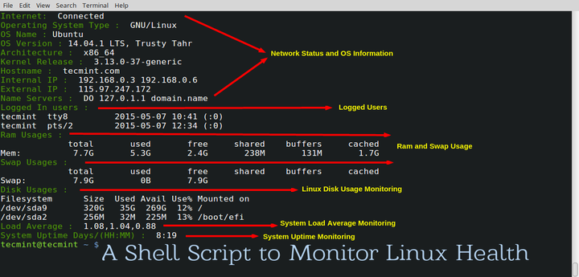

# TECMINT_MONITOR
A Shell Script to Monitor Network, Disk Usage, Uptime, Load Average and RAM usage in Linux.

# USAGE

To execute the script please read its content, using in preference nano editor, and then

```
$ bash tecmint_monitor.sh
```


Or you can install the script with command:

```
$ sudo make install
```

then will available command ```tecmint_monitor```

You can check some basics informations about the script by executing:

```
$ bash tecmint_monitor.sh -h
```

or (after installation)

```
$ tecmint_monitor -h
```

# BUG AND REPORT

Please report to us on [tecmint website](http://www.tecmint.com/linux-server-health-monitoring-script/).

# LICENSE

Released under APACHE v2 (please check the LICENSE file for further informations)

Originally published on http://www.tecmint.com

The original author allowed to upload the script to Github and further develop it.
